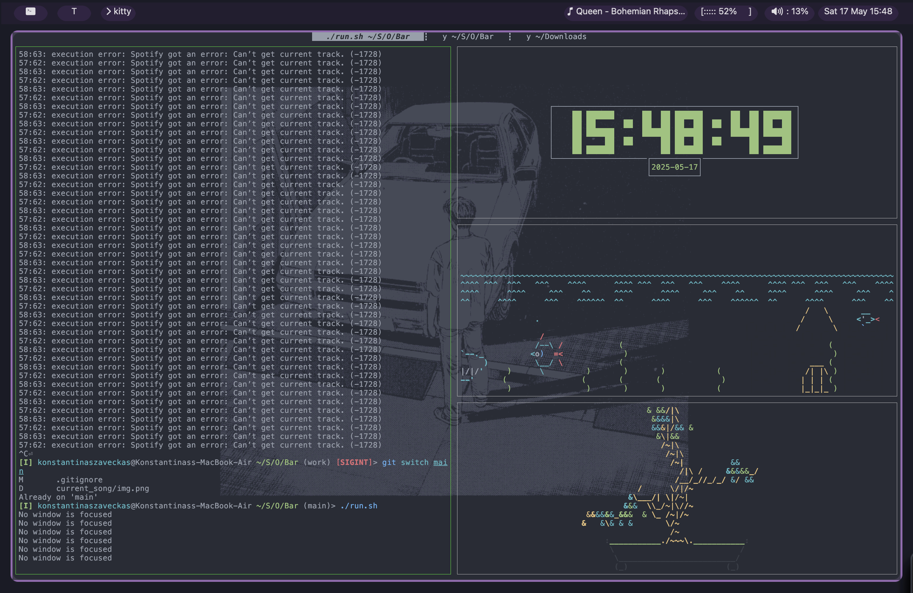

# MENU BAR

## USAGE

This menu bar is created by me and I would not recommend that you try to modify it, tinker with it or use it in any way shape or form as it will probably not work as intended.



## FUNCTIONALITY

Some noteable feature are
- Dynamic song names and current program names (song name cuts off realy because I have a macbook with a notch and i didn't want it to obtruct my view of the song  so I did it my self)
- Custom battery indicator

## RUNNING

Just have clang on your system and run the ```run.sh``` file.
PS. you might need to run ```chmod +x run.sh``` if it says that it's not an executable file or something.
